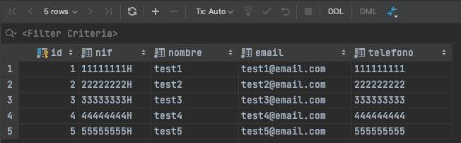

# Replicación de cambios unidireccional con Oracle GoldenGate

Repositorio correspondiente al post de replicación unidireccional con GoldenGate.

## Requisitos

Para poder ejecutar este ejemplo necesitas;

- Docker
- Credenciales de consola de un usuario de AWS con permiso para manejar EC2, RDS Oracle, MSK, VPC, Security Groups

<br/>

## Creando la infraestructura base

### Infraestructura en AWS

Para facilitar la “puesta en escena” del caso de uso vamos a usar los servicios de bases de datos gestionadas (RDS) para disponer de una base de datos Oracle y una base de datos Postgresql. 

La base de datos Oracle, en un caso real, podría estar en un entorno on-premise. En el caso de uso, sí se comenta que uno de los objetivos es ir a una base de datos en Cloud y autogestionada.

En este caso de ejemplo, como queremos facilitar la conexión a los diferentes elementos directamente desde el PC local, hemos definido una VPC con una única subred pública y dotaremos a las bases de datos de acceso público. En un sistema productivo, usaríamos redes privadas. 

A continuación vamos a detallar los pasos a seguir


#### Generando la clave SSH

El script de Terraform necesita un par de claves para crear las instancias EC2 y nosotros usaremos la clave SSH posteriomente para conectarnos a las instancias. 

Por tanto, antes de lanzar el script de Terraform vamos a generar un par de claves ejecutando el siguiente comando desde la raíz del proyecto:

```bash
ssh-keygen -q -N "" -f iac/ssh/ssh_gg
```

Dentro del directorio “iac/ssh” se crearán dos ficheros correspondientes a las claves pública y privada.


#### Creando la infraestructura con Terraform

Para ejecutar las acciones de creación y destrucción de la infraestructura nos vamos a apoyar en una imagen Docker que contiene Terraform y todo lo necesario para levantar la infraestructura. Solo necesitaremos las credenciales de AWS

El primer paso es construir la imagen a partir del Dockerfile. Para ello, desde la raíz del proyecto, lanzamos:

```bash
docker build . -t ogg_infra_builder
```

Después, lanzamos el contenedor y accedemos a él con el comando:

```
docker run -it --rm -e KEY_ID=<AWS_USER_KEY_ID> -e SECRET_ID=<AWS_SECRET_KEY_ID> -v $(pwd)/iac:/root/iac --entrypoint /bin/bash ogg_infra_builder
```

reemplazando 

- AWS_USER_KEY_ID: valor de la KEY del usuario de AWS
- AWS_SECRET_KEY_ID: valor de la SECRET del usuario de AWS

Después, ejecutamos dentro del contenedor el comando:

```
sh build.sh
```


Una vez ejecutado el script y creada la infraestructura, tendremos todo lo necesario para implementar el proceso de replicación. Como salida del script de Terraform, obtendremos algo parecido a lo siguiente:


<br/>

### Creando el modelo de datos inicial en Oracle

Una vez que tenemos la infraestructura creada y levantada, vamos a crear el modelo de datos en Oracle para poder partir del escenario inicial planteado en el caso de uso. Para conectarse a la base de datos podemos usar cualquier cliente compatible. Los datos de conexión son los siguientes:

- **Host**: valor de la variable de salida de Terraform "oracle_endpoint"
- **SID**: ggdemo
- **User/Passw**: oracledb / oracledb

Nos conectamos a la base de datos con nuestro cliente y lanzamos el siguiente script de SQL:

```sql
CREATE TABLE CUSTOMERS 
(
  ID NUMBER NOT NULL, 
  NIF VARCHAR2(9) NULL,
  CIF VARCHAR2(9) NULL,
  EMAIL VARCHAR2(255) NULL, 
  TELEFONO VARCHAR2(20) NOT NULL, 
  NOMBRE VARCHAR2(255) NULL,
  RAZONSOCIAL VARCHAR2(255) NULL,
  DESCRIPCION VARCHAR2(255) NULL,
  TIPO INTEGER NOT NULL,
  REPRESENTANTE VARCHAR2(255) NULL,
  CONSTRAINT CUSTOMERS_PK PRIMARY KEY (ID) ENABLE 
);

CREATE SEQUENCE CUSTOMERS_SEQ;

CREATE TRIGGER CUSTOMERS_TRG 
BEFORE INSERT ON CUSTOMERS 
FOR EACH ROW 
BEGIN
  <<COLUMN_SEQUENCES>>
  BEGIN
    IF INSERTING AND :NEW.ID IS NULL THEN
      SELECT CUSTOMERS_SEQ.NEXTVAL INTO :NEW.ID FROM SYS.DUAL;
    END IF;
  END COLUMN_SEQUENCES;
END;
/

INSERT INTO CUSTOMERS (NIF, EMAIL, TELEFONO, NOMBRE, TIPO) VALUES ('11111111H', 'test1@email.com', '111111111', 'test1', 1);
INSERT INTO CUSTOMERS (NIF, EMAIL, TELEFONO, NOMBRE, TIPO) VALUES ('22222222H', 'test2@email.com', '222222222', 'test2', 1);
INSERT INTO CUSTOMERS (NIF, EMAIL, TELEFONO, NOMBRE, TIPO) VALUES ('33333333H', 'test3@email.com', '333333333', 'test3', 1);
INSERT INTO CUSTOMERS (NIF, EMAIL, TELEFONO, NOMBRE, TIPO) VALUES ('44444444H', 'test4@email.com', '444444444', 'test4', 1);
INSERT INTO CUSTOMERS (NIF, EMAIL, TELEFONO, NOMBRE, TIPO) VALUES ('55555555H', 'test5@email.com', '555555555', 'test5', 1);
INSERT INTO CUSTOMERS (CIF, EMAIL, TELEFONO, RAZONSOCIAL, TIPO) VALUES ('B76365789', 'test6@email.com', '666666666', 'Empresa 1', 2);
INSERT INTO CUSTOMERS (CIF, EMAIL, TELEFONO, RAZONSOCIAL, TIPO) VALUES ('C76462739', 'test7@email.com', '777777777', 'Empresa 2', 2);
INSERT INTO CUSTOMERS (CIF, EMAIL, TELEFONO, RAZONSOCIAL, TIPO) VALUES ('J73422331', 'test8@email.com', '888888888', 'Empresa 3', 2);
COMMIT;
```


### Creando el modelo de datos destino

La siguientes líneas corresponden al script SQL para crear el modelo de datos destino:

```sql
create schema particulares;
alter schema particulares owner to postgres;

create table particulares.customers
(
	id serial not null constraint customers_pk primary key,
	nif varchar not null,
	nombre varchar not null,
	email varchar not null,
	telefono varchar not null
);

create schema empresas;
alter schema empresas owner to postgres;

create table empresas.customers
(
	id serial not null constraint customers_pk primary key,
	cif varchar not null,
	razonsocial varchar not null,
	email varchar not null,
	telefono varchar not null,
	descripcion varchar not null,
	representante varchar not null
);
```


<br/><br/>

## Preparando las base de datos para replicación


### Preparando la base de datos Oracle

Para que el proceso de replicación sea posible necesitamos configurar la base de datos Oracle. Para ello, lanzamos las siguientes sentencias SQL contra la base de datos Oracle:

```
ALTER TABLE CUSTOMERS ADD SUPPLEMENTAL LOG DATA (ALL) COLUMNS;

exec rdsadmin.rdsadmin_util.set_configuration('archivelog retention hours',24);

CREATE TABLESPACE administrator;
CREATE USER oggadm1 IDENTIFIED BY "oggadm1" DEFAULT TABLESPACE ADMINISTRATOR TEMPORARY TABLESPACE TEMP;
alter user oggadm1 quota unlimited on ADMINISTRATOR;
GRANT UNLIMITED TABLESPACE TO oggadm1;


GRANT CREATE SESSION, ALTER SESSION TO oggadm1;
GRANT RESOURCE TO oggadm1;
GRANT SELECT ANY DICTIONARY TO oggadm1;
GRANT FLASHBACK ANY TABLE TO oggadm1;
GRANT SELECT ANY TABLE TO oggadm1;
GRANT INSERT ANY TABLE TO oggadm1;
GRANT UPDATE ANY TABLE TO oggadm1;
GRANT DELETE ANY TABLE TO oggadm1;
GRANT CREATE ANY TABLE TO oggadm1;
GRANT ALTER ANY TABLE TO oggadm1;
GRANT LOCK ANY TABLE TO oggadm1;

GRANT SELECT_CATALOG_ROLE TO oggadm1 WITH ADMIN OPTION;
GRANT EXECUTE ON DBMS_FLASHBACK TO oggadm1;
GRANT SELECT ON SYS.V_$DATABASE TO oggadm1;
GRANT ALTER ANY TABLE TO oggadm1;
GRANT CREATE CLUSTER TO oggadm1;
GRANT CREATE INDEXTYPE      TO oggadm1;
GRANT CREATE OPERATOR       TO oggadm1;
GRANT CREATE PROCEDURE      TO oggadm1;
GRANT CREATE SEQUENCE       TO oggadm1;
GRANT CREATE TABLE          TO oggadm1;
GRANT CREATE TRIGGER        TO oggadm1;
GRANT CREATE TYPE           TO oggadm1;

exec rdsadmin.rdsadmin_util.grant_sys_object ('DBA_CLUSTERS', 'OGGADM1');
exec rdsadmin.rdsadmin_dbms_goldengate_auth.grant_admin_privilege (grantee=>'OGGADM1', privilege_type=>'capture', grant_select_privileges=>true, do_grants=>TRUE);
exec rdsadmin.rdsadmin_util.force_logging(p_enable => true);
exec rdsadmin.rdsadmin_util.alter_supplemental_logging('ADD','PRIMARY KEY');
```

> **ATENCIÓN:** El script está preparado para ser lanzado en una base de datos AWS RDS Oracle, que es la que utilizamos en este ejemplo. De ahí las sentencias del tipo “exec rdsadmin.“


### Preparando la base de datos Postgresql

De forma similar al punto anterior, en Postgresql también tenemos que crear el usuario asociado a GoldenGate. Para ello se debe lanzar el siguiente script contra la base de datos Postgresql:

```sql
create user oggadm1;
alter user oggadm1 with password 'oggadm1';
grant connect on database ggdemo to oggadm1;
grant usage on schema particulares to oggadm1;
grant usage on schema empresas to oggadm1;
grant rds_replication to oggadm1;
grant all privileges on all tables in schema particulares to oggadm1;
grant all privileges on all sequences in schema particulares to oggadm1;
grant all privileges on all tables in schema empresas to oggadm1;
grant all privileges on all sequences in schema empresas to oggadm1;
grant all privileges on database "ggdemo" to oggadm1;

create schema ogg;
alter schema ogg owner to oggadm1;
```

<br/><br/>

## Instalando Oracle GoldenGate Classic

### Ficheros necesarios

- **Distribución de Oracle GoldenGate Classic**
  Debes descargar la release de Oracle GoldenGate Classic desde la [página oficial de Oracle](https://www.oracle.com/es/middleware/technologies/goldengate-downloads.html). 

  Selecciona la versión “[Oracle GoldenGate 19.1.0.0.4 for Oracle on Linux x86-64](https://www.oracle.com/es/middleware/technologies/goldengate-downloads.html#license-lightbox)“
  Una vez descargado, lo tenemos que copiar en la máquina EC2 destinada a contener Oracle GoldenGate Classic. 

  

- **Distribución de Oracle Instant Client**
  Debes descargar la release de Oracle Instant Client desde la [página oficial de Oracle](https://download.oracle.com/otn_software/linux/instantclient/1911000/instantclient-basic-linux.x64-19.11.0.0.0dbru.zip). A continuación cópialo a la máquina EC2 que va a ejecutar Oracle GoldenGate Classic 


### Instalación y configuración de Oracle GoldenGate Classic

#### Instalando el producto

Una vez copiados los ficheros, nos conectamos a la máquina por SSH (en la salida del script de Terraform, aparece como “oracle_ggc_public_ip”).

> Al ser instancias de EC2 basadas en RHEL, el usuario es “ec2-user”. La clave SSH se encuentra en el repositorio (“iac/ssh/ssh_gg”)

Creamos los siguientes directorios:

```bash
mkdir /home/ec2-user/ggc-install
mkdir /home/ec2-user/ggc
mkdir /home/ec2-user/oraInventory
mkdir /home/ec2-user/oracle_instant_client_19c
mkdir /home/ec2-user/tnsnames
```

A continuación, procedemos a instalar el cliente de base de datos **Oracle Instant Client**. Para ello, lanzamos:

```bash
cd /home/ec2-user/oracle_instant_client_19c
unzip -j /tmp/instantclient-basic-linux.x64-19.11.0.0.0dbru.zip
```

Ahora vamos a extraer el ZIP de **Oracle GoldenGate Classic** para poder instalarlo;

```bash
cd /home/ec2-user/ggc-install
unzip /tmp/191004_fbo_ggs_Linux_x64_shiphome.zip
```

Como vamos a realizar la instalación en modo silencioso para no tener que instalar el entorno gráfico en la máquina EC2, debemos crear un fichero *.rsp* que contiene los parámetros necesarios para la instalación. Lanzamos:

```bash
vi /home/ec2-user/ggc-install/ggc-install.rsp
```

Y copiamos lo siguiente:

```bash
oracle.install.responseFileVersion=/oracle/install/rspfmt_ogginstall_response_schema_v19_1_0
INSTALL_OPTION=ORA19c
SOFTWARE_LOCATION=/home/ec2-user/ggc
INVENTORY_LOCATION=/home/ec2-user/oraInventory
UNIX_GROUP_NAME=ec2-user
```

Una vez que hemos creado el fichero ".rsp", procedemos a ejecutar la instalación:

```bash
cd /home/ec2-user/ggc-install/fbo_ggs_Linux_x64_shiphome/Disk1/
./runInstaller -silent -showProgress -waitforcompletion -responseFile /home/ec2-user/ggc-install/ggc-install.rsp
```

Cuando el proceso de instalación finalice, creamos la siguiente variable de entorno:

```bash
export LD_LIBRARY_PATH=/home/ec2-user/oracle_instant_client_19c
```


#### Configurando el acceso a base de datos

Para que Oracle GoldenGate Classic pueda acceder a la base de datos Oracle es necesario configurar la conexión. Esto se realiza mediante el fichero "*tnsnames.ora*". Para ello, creamos el fichero “tnsnames.ora” en el directorio “/home/ec2-user/tnsnames”:

```bash
vi /home/ec2-user/tnsnames/tnsnames.ora
```

E incluimos las siguientes líneas:

```bash
ORARDS =
  (DESCRIPTION =
    (ADDRESS = (PROTOCOL = TCP)(HOST = #ORACLE_RDS_ENDPOINT#)(PORT = 1521))
    (CONNECT_DATA =
      (SID = ggdemo)
    )
  )
```

Sustituyendo #ORACLE_RDS_ENDPOINT# por el valor correspondiente a la base de datos Oracle creada. Como se ha comentado anteriormente, el valor se puede consultar en la consola de AWS o de la salida del script de Terraform, en la clave “oracle_endpoint”

Por último, hay que definir la variable de entorno TNS_ADMIN:

```bash
export TNS_ADMIN=/home/ec2-user/tnsnames
```


#### Creando la estructura inicial de directorios para GoldenGate Classic

Una vez que hemos terminado la instalación como tal, vamos a ejecutar el intérprete de comandos de Oracle GoldenGate, GGSCI. Para ello, nos conectamos a la máquina de nuevo y ejecutamos:

```bash
cd /home/ec2-user/ggc
./ggsci
```

Y se abrirá el cliente de Oracle GoldenGate para que podamos ejecutar comandos sobre él. El primer comando será el que genere la estructura inicial de directorios:

```bash
CREATE SUBDIRS
```

Como resultado se generarán todos los directorios que Oracle GoldenGate necesita.


#### Creando el almacén de credenciales

En Oracle GoldenGate podemos definir un almacén de credenciales para asociar un alias a los datos de conexión a la base de datos (usuario / password) y, hacer referencia al alias en los procesos de extracción o replicación. Para crear el almacén de credenciales, entramos en GGSCI y ejecutamos:

```bash
add credentialstore
```


Después, añadimos los datos referentes a la conexión que hemos definido anteriormente en el fichero *tnsnames.ora*:

```
alter credentialstore add user oggadm1@ORARDS, password oggadm1, alias orards 
```


#### Inicializando el componente Manager

El Manager es un componente principal de GoldenGate que se encarga de arrancar, parar, monitorizar o lanzar errores de los diferentes elementos. Para inicializar este componente, al igual que con el resto de elementos de GoldenGate, usamos GGSCI. Lo primero que tenemos que hacer es definir sus parámetros, en este caso, el puerto. Para ello, dentro de GGSCI, ejecutamos:

```bash
edit params mgr
```


Se abrirá un editor vi en el que añadimos únicamente:

```
PORT 7810 
```

Una vez definido el puerto, arrancamos el Manager. Para ello, desde GGSCI, escribimos:

```
start mgr
```

Para comprobar que está levantado, ejecutamos el comando:

```
info mgr
```

y verificamos que está en estado RUNNING


#### Comprobando la instalación

Podemos hacer una pequeña prueba para ver que todo se ha instalado y configurado correctamente. Para ello, vamos a intentar hacer login en la base de datos Oracle utilizando el almacén de credenciales. Desde GGSCI lanzamos:

```bash
dblogin useridalias orards
```

Si todo está correcto, veremos un mensaje indicando que se ha hecho login en la base de datos.


<br/><br/>

## Instalando Oracle GoldenGate Postgresql


### Ficheros necesarios

Similar a la instalación de Oracle GoldenGate Classic, es necesario descargar los siguientes ficheros:

- **Distribución de Oracle GoldenGate Postgresql**, a partir del siguiente [enlace](https://download.oracle.com/otn/goldengate/19100/19100200714_ggs_Linux_x64_PostgreSQL_64bit.zip)


### Instalación de GoldenGate Postgresql en EC2

Una vez descargado y copiado al EC2, accedemos al EC2 (IP mostrada en la variable "oracle_ggc_postgresql_public_ip" de la salida de Terraform) mediante ssh para proceder a la instalación. Creamos el directorio donde lo vamos a instalar y descomprimimos el ZIP y el TAR:

```bash
mkdir /home/ec2-user/gg-postgresql
cd /home/ec2-user/gg-postgresql
unzip -j /tmp/19100200714_ggs_Linux_x64_PostgreSQL_64bit.zip
tar xvf ggs_Linux_x64_PostgreSQL_64bit.tar
```

Una vez descomprimido, creamos la siguiente variable de entorno:

```bash
export LD_LIBRARY_PATH=/home/ec2-user/gg-postgresql/lib
```

<br/>

### Creando la estructura inicial de directorios

Al igual que hicimos en la instalación de Oracle GoldenGate Classic, en GoldenGate Postgresql también debemos generar la estructura de directorios inicial, mediante la ejecución del siguiente comando desde GGSCI:

```bash
CREATE SUBDIRS
```

El resultado del comando generará todos los directorios necesarios


### Abriendo los puertos del firewall

Oracle GoldenGate Postgresql debe aceptar las conexiones desde Oracle GoldenGate Classic. 
Para este ejemplo vamos a abrir un rango de puertos amplio, aunque sería posible definir en el Manager qué puertos son los elegidos para las conexiones.Ejecutamos desde el terminal de la instancia EC2 de GoldenGate Postgresql los siguientes comandos:

```bash
sudo firewall-cmd --permanent --add-port=1000-61000/tcp
sudo firewall-cmd --reload
```


### Configurando la conexión a la base de datos (ODBC)

Para que GoldenGate Postgresql pueda conectar a la base de datos, se necesita configurar la conexión mediante ODBC. Para ello, creamos el fichero “obdc.ini”:

```bash
vi /home/ec2-user/gg-postgresql/odbc.ini
```


Y añadimos las siguientes líneas:

```bash
[ODBC Data Sources]
PostgreSQL on pgsql
[ODBC]
IANAAppCodePage=4
InstallDir=/home/ec2-user/gg-postgresql
[pg96db]
Driver=/home/ec2-user/gg-postgresql/lib/GGpsql25.so
Description=Postgres driver
Database=ggdemo
HostName=#POSTGRESQL_ENDPOINT#
PortNumber=5432
LogonID=oggadm1
Password=oggadm1
```


Tenemos que sustituir #POSTGRESQL_ENDPOINT# por el valor real del endpoint, que viene dado por la salida del script de Terraform en la clave “postgresql_endpoint“. 

También tenemos que definir la variable de entorno ODBCINI. Para ello, lanzamos:

```bash
export ODBCINI=/home/ec2-user/gg-postgresql/odbc.ini
```


### Inicializando el Manager

En este caso, como hicimos con GoldenGate Classic, también debemos inicializar el componente Manager en la instancia de GoldenGate Postgresql. Lo primero es definir sus parámetros escribiendo en GGSCI:

```bash
edit params mgr
```


Se abrirá un editor vi en el que añadimos el puerto y permisos para que se pueda acceder desde GG Classic. En este ejemplo, lo abrimos a todas las direcciones para facilitar la prueba:

```bash
PORT 28710
ACCESSRULE, PROG *, IPADDR *, ALLOW
```


Guardamos y salimos. Para arrancar el Manager tenemos que ejecutar:

```bash
start mgr
```

Podemos comprobar que efectivamente está levantado mediante el comando:

```bash
info mgr
```

<br/><br/>

## Implementando el proceso de carga inicial


### Creando el extract en GG Classic

Lo primero que tenemos que hacer es crear el “extract” en GoldenGate Classic. Para ello, nos conectamos de nuevo a la máquina EC2 de GoldenGate Classic y volvemos a entrar en GGSCI:

```bash
cd /home/ec2-user/ggc
./ggsci
```


### Creando el fichero de parámetros

El primer paso es definir los parámetros del “extract”. Tal y como hemos determinado en el apartado de diseño, lo vamos a llamar “einiload”. Para ello, en GGSCI, escribimos el siguiente comando:

```
edit params einiload
```


Como siempre que creamos o editamos ficheros de parámetros, GGSCI abre un editor vi. En el editor, añadimos lo siguiente y guardamos:

```bash
extract einiload
useridalias orards
rmthost #IP_PRIVADA_EC2_GG_POSTGRESQL#, mgrport 28710
rmttask replicat, group riniload
table oracledb.customers;
```

Debemos reemplazar *#IP_PRIVADA_EC2_GG_POSTGRESQL#* por el valor que tenga en la salida del script de Terraform, en la clave: “*oracle_ggc_postgresql_private_ip*”.

En este fichero de parámetros, estamos estableciendo que:

- está asociado al extract “einiload”
- usa el almacén de credenciales para conectarse a la base de datos Oracle
- va a enviar los datos a un host remoto (máquina de GG Postgresql)
- en el host remoto, se debe ejecutar una tarea remota de replicación, llamada “riniload”se van a seleccionar los datos de la tabla “CUSTOMERS” del esquema “ORACLEDB”


### Creando el extract

Una vez hemos definido el fichero de parámetros, tenemos que crear realmente el extract. Para ello, ejecutamos los siguientes pasos dentro de GGSCI:

1. Hacemos login en la base de datos:

   ```bash
   dblogin useridalias orards
   ```

   

2. Añadimos el “extract” y le decimos que la fuente son las propias tablas (en nuestro caso, una):

   ```bash
   add extract einiload, sourceistable
   ```

   

### Creando el replicat en GG Postgresql

Una vez configurada la parte correspondiente al origen, es decir, GoldenGate Classic, tenemos que configurar la parte correspondiente al destino, GG Postgresql, que se encargará de la carga inicialCreando el fichero de parámetros.

Para ello, nos conectamos a la máquina EC2 de GoldenGate Postgresql y volvemos a entrar en GGSCI:

```bash
cd /home/ec2-user/gg-postgresql
./ggsci
```


A continuación, de forma similar a como hemos hecho en el punto anterior con el extract, creamos los parámetros asociados al replicat “riniload”. Escribimos:

```
edit params riniload
```


Como contenido del fichero de parámetros, establecemos lo siguiente:

```bash
replicat riniload
setenv ( pgclientencoding = "utf8" )
setenv (nls_lang="american_america.al32utf8")
targetdb pg96db, userid oggadm1, password oggadm1
discardfile ./dirrpt/customers.dsc, purge
map oracledb.customers, target particulares.customers, where (tipo = 1);
map oracledb.customers, target empresas.customers, where (tipo = 2);
```


En este fichero estamos diciendo que

1. está asociado al fichero de parámetros “riniload”
2. establecemos el tipo de encoding
3. establecemos el tipo de codificación que usa el cliente
4. indicamos que se debe conectar a la base de datos con identificador pg96db, definida en el fichero odbc.ini
5. configuramos el fichero de descartes a ./dirrpt/customers.dsc
6. hacemos el mapeo de que los datos que llegan de Oracle con el valor de la columna TIPO a 1, se mandan a la tabla CUSTOMERS del esquema PARTICULARES, en Postgresql
7. hacemos el mapeo de que los datos que llegan de Oracle con el valor de la columna TIPO a 2, se mandan a la tabla CUSTOMERS del esquema EMPRESAS, en Postgresql


### Creando el replicat

El siguiente paso consiste en la creación del replicat asociado al fichero de parámetros. Para ello, en GGSCI, escribimos:

```bash
add replicat riniload, specialrun
```


Como se ha comentado anteriormente, en la carga inicial, el replicat no es un proceso que esté levantado esperando que lleguen cambios a aplicar en la base de datos, como sería en el proceso de CDC. En este caso, lo añadimos con el tipo “specialrun”, que quiere decir que será ejecutado en modo “batch” por el manager cuando lleguen los datos de la carga inicial. 


<br/><br/>

## Implementando el proceso de CDC

### Creando el extract (en GG Classic)

Nos conectamos de a la máquina EC2 de GoldenGate Classic y entramos en GGSCI

#### Creando el fichero de parámetros

De forma similar a como lo hemos hecho en la carga inicial, tenemos que crear el fichero de parámetros asociados al extract. Tal y como hemos determinado en el apartado de diseño, lo vamos a llamar “ecdcora” y de este modo, intentar indicar con los ocho caracteres que permite GoldenGate, que es el extract primario correspondiente al proceso de CDC desde Oracle. Escribimos el siguiente comando:

```bash
edit params ecdcora
```


Como siempre que creamos o editamos ficheros de parámetros, GGSCI abre un editor vi. En el editor, añadimos lo siguiente y guardamos:

```
extract ecdcora
useridalias orards
exttrail ./dirdat/lt
table oracledb.customers;
```

En este fichero de parámetros, estamos diciendo a GoldenGate que:

1. está asociado al extract “ecdcora”
2. usa el almacén de credenciales para conectarse a la base de datos Oracle
3. se asocia a los ficheros locales de “trail” con prefijo “lt”
4. va a procesar los cambios correspondientes a la tabla CUSTOMERS del esquema “oracledb”


#### Creando el extract

Una vez hemos definido el fichero de parámetros, tenemos que crear el extract. Para ello, ejecutamos los siguientes pasos dentro de GGSCI: 

1. Hacemos login en la base de datos:

```bash
dblogin useridalias orards
```

2. Registramos el extract en la base de datos:

   ```
   register extract ecdcora database
   ```

   veremos que GGSCI nos responde con un SCN, con número concreto. En mi caso (725649):

   

   

   Este SCN es el correspondiente a la transacción que se ha realizado para registrar el extract en la base de datos y lo usaremos a continuación como inicio del proceso de CDC 

   

3. Añadimos el extract y le decimos que “empiece” a partir de ese SCN:

   ```bash
   add extract ecdcora, integrated tranlog, scn 725649
   ```

   

4. El siguiente paso es declarar los ficheros “locales” de trail asociados al extract:

   ```
   add exttrail ./dirdat/lt, extract ecdcora
   ```

   

Ahora podemos iniciar el extract para que empiece a capturar datos y generando ficheros trail locales con prefijo “lt”. Para ello, lanzamos:

```
start ecdcora
```

Podemos comprobar que está arrancando y datos como el SCN, mediante el comando:

```
info ecdcora
```

Obteniendo un resultado similar al de la imagen:


<br/>

### Creando el data pump (en GG Classic)

Una vez que tenemos el extract, tenemos que configurar el data pump o extract secundario. Este elemento, leerá de los ficheros locales de trail y generará los ficheros remotos de trail. De forma similar a todos los elementos anteriores, lo primero que tenemos que hacer es definir los parámetros. Para ello, ejecutamos:

```
edit params pcdcora
```


En el editor que se abre, escribimos:

```
extract pcdcora
passthru
rmthost #IP_PRIVADA_EC2_GG_POSTGRESQL#, mgrport 28710
rmttrail ./dirdat/rt
table oracledb.customers;
```


Debemos reemplazar #IP_PRIVADA_EC2_GG_POSTGRESQL# por el valor que tenga en la salida del script de Terraform. En concreto, la clave: “oracle_ggc_postgresql_private_ip”

En este fichero estamos diciendo:

1. se asocia al extract (Data Pump) “pcdcora”
2. “passthru” indica que no tiene que aplicar ningún fichero de definición de tablas
3. va a enviar los trail a un host remoto
4. los ficheros trail remoto serán los que empiezan por “rt”
5. va a seleccionar los cambios de la tabla “CUSTOMER” del esquema “ORACLEDB” 


A continuación vamos a añadir el Data Pump. Primero tenemos que hacer login:

```
dblogin useridalias orards
```


Después, lanzamos el siguiente comando para añadir el Data Pump, indicando que está activo desde este mismo momento:

```
add extract pcdcora, exttrailsource ./dirdat/lt, begin now
```

Por último, asociamos el trail remoto:

```
add rmttrail ./dirdat/rt extract pcdcora
```

Para arrancar el Data Pump, ejecutamos:

```
start pcdcora
```

Y verificamos que se ha arrancado bien mediante el siguiente comando:

```
info pcdcora 
```

obteniendo un resultado similar al siguiente:


<br/>

### Creando el Replicat (en GG Postgresql)

Una vez que hemos configurado la parte “origen” tenemos que configurar el “Replicat” para que replique los datos en Postgresql, cada parte en su tabla correspondiente (particulares / empresas)

Como siempre, lo primero es definir el fichero de parámetros, que va a ser muy similar al de la carga inicial. Para ello, lanzamos el siguiente comando desde GGSCI en la máquina EC2 de Postgresql:

```
edit params rcdcora
```

En el editor que aparece, copiamos:

```
replicat rcdcora
assumetargetdefs
discardfile ./dirrpt/rcdcora.dsc, purge, megabytes 100
targetdb pg96db, userid oggadm1, password oggadm1
map oracledb.customers, target particulares.customers, where (tipo = 1);
map oracledb.customers, target empresas.customers, where (tipo = 2);
```

En ese fichero, estamos diciendo:

1. lo vamos a asociar al replicat “rcdcora”
2. con “assumetargetdefs” indicamos que la estructura (si no se indica nada en los mapeos) es similar en origen y destino
3. que utilice un fichero de descartes llamado “rcdcora.dsc”
4. establecemos los mapeos, indicando que los registros con TIPO = 1 van a la tabla “CUSTOMERS” del esquema “particulares” y los que tengan TIPO = 2 van a la tabla “CUSTOMERS” del esquema “empresas” 


Ahora, vamos a añadir y configurar el replicat. Lo primero es hacer login en la base de datos:

```
dblogin sourcedb pg96db, userid oggadm1, password oggadm1
```

A continuación, establecemos el uso de una tabla (interna) de control para llevar el registro de qué se ha replicado. Para ello lanzamos:

```
add checkpointtable ogg.chkptable
```

Después, añadimos el replicat y lo asociamos a la tabla de control:

```
add replicat rcdcora, exttrail ./dirdat/rt, checkpointtable ogg.chkptable
```

Por último, arrancamos el replicat y comprobamos que arranca correctamente:

```
start rcdcora
info rcdcora
```


<br/><br/>

## Probando el proceso de replicación

### Ejecutando la carga inicial

Para lanzar el proceso, lo tenemos que hacer desde el origen, es decir, desde GoldenGate Classic. Para ello, nos conectamos a la máquina EC2 donde está instalado GoldenGate Classic, y accedemos a GGSCI. Una vez dentro, arrancamos el extract de carga inicial:

```bash
start einiload
```


#### Verificando el proceso en el origen

Para verificar que el proceso se ha lanzado correctamente, ejecutamos en GoldenGate Classic:

```
info einiload
```


Debemos ver que ha procesado 8 registros:


Si queremos ver más detalle, podemos ejecutar:

```
view report einiload
```


Al final del informe nos aparecen los datos detallados:


<br/>

#### Verificando el proceso en el destino

En el lado de Postgresql podemos hacer algo similar. Nos conectamos al EC2 donde está instalado GG Postgresql y entramos en GGSCI:

```
cd /home/ec2-user/gg-postgresql
./ggsci
```


Dentro del intérprete, si escribimos “info riniload” no vamos a obtener mucha información. Tenemos que ir directamente al informe, ejecutando:

```
view report riniload
```


En el informe, podemos encontrar las estadísticas y verificar que se han realizado ocho inserciones, de las cuales, cinco han ido al esquema de particulares y tres al esquema de empresas:


Por último, vamos a comprobar que realmente los datos se han replicado correctamente en Postgresql, cada uno la tabla correspondiente. Por ejemplo, en el caso de particulares:



En el caso de empresas:


<br/>

### Probando la replicación de datos

Una vez que hemos lanzado la carga inicial y comprobado que ambos extremos están sincronizados, podemos probar el proceso de replicación.

#### Insertando nuevos datos

Lanzamos las siguientes sentencias INSERT sobre la tabla Oracle:

```sql
insert into customers (nif, email, telefono, nombre, tipo) values ('00000000h', 'nuevo_particular@email.com', '123456789', 'nuevo particular', 1);
insert into customers (cif, email, telefono, razonsocial, tipo, descripcion, representante) values ('b76785789', 'nueva_empresa@email.com', '000000000', 'empresa nueva', 2, 'descripción empresa nueva', 'representante empresa nueva');
commit;
```

Si recuperamos los datos de la tabla en Oracle, vemos que se han insertado correctamente. Pero lo importante es comprobar en Postgresql que se han replicado los datos. Primero en “particulares”:


Efectivamente vemos que se ha insertado la nueva fila en particulares. A continuación, hacemos lo mismo en “empresas”:


Y verificamos que se ha insertado la nueva fila en empresas.


#### Actualizando datos

A continuación vamos a probar que los datos se actualizan también en tiempo real. Para ello, lanzamos estas dos sentencias sobre la base de datos Oracle:

```sql
update oracledb.customers set nombre = 'test1 - upd' where id=1;
update oracledb.customers set descripcion = 'descripción empresa', representante = "representante empresa" where id in (6,7,8);
commit;
```

El resultado de esta acción debe ser una fila de particulares actualizada (ID = 1) en la columna nombre y tres filas de empresas actualizadas (IDs 6,7 y 8) en las columnas DESCRIPCION y REPRESENTANTE
Comprobamos primero, en Postgresql y el esquema particulares, que se ha actualizado el nombre de la fila con ID = 1:


A continuación, comprobamos lo mismo en la tabla CUSTOMERS del esquema empresas, que todas tienen valor en las columnas DESCRIPCION y REPRESENTANTE como resultado de la acción de actualización en Oracle:


#### Eliminando datos

Por último vamos a probar que también se reflejan los cambios correspondientes a los DELETES. Para ello, lanzamos estas sentencias sobre la base de datos Oracle:

```sql
delete oracledb.customers where id in (9,10);
commit;
```

Comprobamos que se han eliminado en Postgresql las filas con las que hemos estado trabajando. Primero en particulares, no debe existir una fila con ID = 9:


Hacemos lo correspondiente en empresas, comprobando que no existe una fila con ID = 10:


<br/>

### Comprobando las estadísticas de GoldenGate

Podemos acceder tanto a GoldenGate Classic, que está conectado al origen (Oracle) como a GoldenGate Postgresql, conectado al destino (Postgresql) para comprobar las estadísticas. Durante el proceso de replicación hemos realizado:

- INSERTS: 2
- UPDATES: 4
- DELETES: 2

Lo podemos comprobar mediante las estadísticas de GoldenGate

#### Estadísticas en el origen

Primero comprobamos las del extract primario (ecdcora) lanzando, en GGSCI, el comando:

```
stats ecdcora
```

Vemos que el resultado coincide con lo esperado:


<br/>

Podemos hacer lo mismo con el extract secundario o data pump, lanzando:

```
stats pcdcora
```

El resultado también es el esperado:


<br/>

#### Estadísticas en el destino

En destino, tenemos que separar las estadísticas por esquema, ya que según la columna TIPO, los datos se replican en un esquema o en otro. Resumiendo, los datos esperados son:

- INSERTS: 2 (total) → 1 en particulares y 1 en empresas
- UPDATES: 4 (total) → 1 en particulares y 3 en empresas
- DELETES: 2 (total) → 1 en particulares y 2 en empresas 


Para comprobarlo, en GGSCI de la máquina de GoldenGate Postgresql lanzamos:

```
stats rcdcora
```

Si tomamos las estadísticas correspondientes a “particulares” vemos que se cumple lo esperado:


Y si comprobamos las correspondientes a empresas, vemos que también se cumplen los valores esperados:


<br/><br/>

## Destruyendo la infraestructura

Una vez terminada la prueba, para destruir la infraestructura basta con lanzar el script de destrucción, desde el contenedor Docker que creamos al inicio. Si nos hemos salido, basta con ejecutar:

```bash
docker run -it --rm -e KEY_ID=<AWS_USER_KEY_ID> -e SECRET_ID=<AWS_SECRET_KEY_ID> -v $(pwd)/iac:/root/iac --entrypoint /bin/bash ogg_infra_builder
```

reemplazando 

- AWS_USER_KEY_ID: valor de la KEY del usuario de AWS
- AWS_SECRET_KEY_ID: valor de la SECRET del usuario de AWS

Después, ejecutamos dentro del contenedor el comando:

```bash
sh destroy.sh
```

